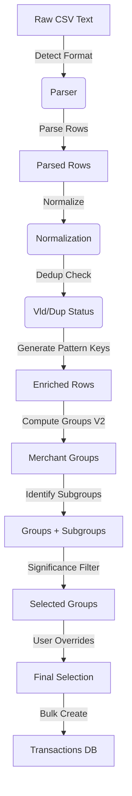

# Luma Budget - CSV Wizard Logic Specification

## 1. Executive Summary
The CSV Import Wizard transforms raw CSV text into structured `Transaction` entities. Its core philosophy is **"Pattern-Based Grouping"**: instead of categorizing rows one-by-one, the user acts on groups of similar transactions (e.g., "Amazon", "Uber").

Key features:
*   **Deterministic Normalization**: Cleans descriptions to identifying "Merchant Patterns".
*   **Intelligent Grouping**: Clusters transactions by pattern, then by exact amount (Subgroups) to identify recurring subscriptions.
*   **Strict Deduplication**: Prevents double-imports with a ±1 day tolerance strategy.
*   **Significance Scoring**: Auto-selects high-value groups (threshold-based) to prioritize "big rocks" first.
*   **Safe Import**: All transactions in a batch share an `importId` for atomic Undo/Rollback.

## 2. Data Model

### 2.1 Input Level
*   **`ParsedCSVRow`**: Raw data from CSV parser.
    *   `amountCents`: Integer, signed (negative = expense).
    *   `date`: ISO 8601 string (YYYY-MM-DD).
    *   `description`: Raw string.
    *   `rawValues`: For debugging.

### 2.2 Processing Level
*   **`PreviewRow`** (extends `ParsedCSVRow`):
    *   `isValid`: False if date/amount/desc missing or malformed.
    *   `isDuplicate`: True if found in DB (with tolerance) or in current batch.
    *   `isSelected`: User toggle (default: true if valid & !duplicate & significant).
    *   `selectedCategoryId`: The final category assigned to this row.

### 2.3 Grouping Level
*   **`MerchantGroupV2`**: A cluster of rows sharing the same `patternKey`.
    *   `patternKey`: Unique ID based on normalized description tokens.
    *   `subgroups`: List of `AmountSubgroup`.
    *   `isSignificant`: `totalAbsCents >= threshold`.
*   **`AmountSubgroup`**: A cluster within a group sharing the exact `amountAbs`.
    *   Criteria: Count ≥ 2.
    *   `isSplit`: Boolean flag. If true, this subgroup needs distinct categorization.

## 3. End-to-End Pipeline

## 4. Detailed Rules

### 4.1 Normalization & Pattern Keys
**Goal**: Identify the "Merchant" regardless of transaction clutter.
*   **Source**: `src/features/import-csv/normalization-utils.ts`
*   **Steps**:
    1.  `normalizeBase`: Lowercase, remove special chars (except space), collapse whitespace.
    2.  `tokenize`: Split by space.
    3.  `filter`: Remove STOPWORDS ("il", "del", "pagamento"), BANKING_PREFIXES ("pos", "sdd"), LEGAL ("srl", "spa").
    4.  `classify`: Identify "variables" vs "useful" tokens.
    5.  **Pattern Key**: Join "useful" tokens.
*   **Fallback**: If ≤1 useful token remains, use first 3 words of cleaned description. Key suffix: `|income` or `|expense`.

### 4.2 Grouping & Subgroups
**Goal**: Group by Merchant, then refine by Amount.
*   **Source**: `src/features/import-csv/grouping-utils-v2.ts`
*   **Grouping**: All rows with same `patternKey` -> 1 `MerchantGroupV2`.
*   **Subgroups**: Inside a group, rows with **identical absolute amount** are clustered.
    *   Condition: Count ≥ `MIN_DUP_COUNT` (2).
    *   Logic: Identify recurring costs (e.g., Netflix €12.99) vs sporadic (Amazon €45.20).

### 4.3 Deduplication
**Goal**: Prevent double entry.
*   **Source**: `src/features/import-csv/dedupe-utils.ts`
*   **Key**: `YYYY-MM-DD|normalizedDesc|absAmount`.
*   **Tolerance**: Matches if key exists for `date`, `date - 1 day`, or `date + 1 day`.
*   **Internal**: Also checks if the CSV file itself contains duplicate rows (exact match).

### 4.4 Category Assignment Priority
When generating the final transaction, category is decided in this order:
1.  **Row Override**: (Not currently exposed in UI, but supported in model `row.selectedCategoryId`).
2.  **Subgroup Override**: If `subgroup.isSplit` is true, use Subgroup's specific category.
3.  **Group Category**: Use `group.assignedCategoryId`.
4.  **Default**: "altro" (Other).

### 4.5 Import Construction
**Goal**: Create persistent records.
*   **Source**: `src/features/import-csv/import-service.ts`
*   **Attributes**:
    *   `importId`: Shared UUID for the batch.
    *   `isSuperfluous`: Derived **only** if `type === 'expense'` AND `Category.spendingNature === 'superfluous'`.
    *   `classificationSource`: Set to `"ruleBased"`.
    *   `icon`: Inherited from Category.

## 5. Invariants & Edge Cases
1.  **Date Validity**: Rows with unparseable dates are marked `isValid: false` and cannot be selected.
2.  **Amounts**: Always stored as integers (cents). Negative = Expense, Positive = Income.
3.  **Subgroup Integrity**: A row belongs to exactly one subgroup (or none). Splitting a subgroup affects all its rows.
4.  **Significance**: Groups below threshold are unselected by default, but can be manually selected. Their rows remain valid.

## Appendix: Source of Truth Map

| Feature | Function / Component | File |
| :--- | :--- | :--- |
| **Parsing** | `parseCSVToRows` | `src/features/import-csv/csv-parser.ts` |
| **Date Parsing** | `parseDateToISO` | `src/features/import-csv/csv-parser.ts` |
| **Norm/Tokenization** | `generatePatternKey` | `src/features/import-csv/normalization-utils.ts` |
| **Stopwords** | `STOPWORDS`, `BANKING_PREFIXES` | `src/features/import-csv/normalization-utils.ts` |
| **Grouping V2** | `computeGroupsV2` | `src/features/import-csv/grouping-utils-v2.ts` |
| **Subgroups** | `computeSubgroups` | `src/features/import-csv/grouping-utils-v2.ts` |
| **Deduplication** | `checkDuplicateWithMap` | `src/features/import-csv/dedupe-utils.ts` |
| **Payload Creation** | `bulkCreateTransactions` | `src/features/import-csv/import-service.ts` |
